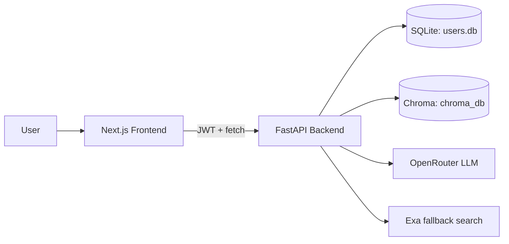

# Industrial & Engineering Intelligence Copilot

Industrial AI copilot for document ingestion, persistent chat, and role-based knowledge access. The repository contains a Next.js frontend and a FastAPI backend, with JWT authentication, SQLite persistence, and a Chroma-backed retrieval pipeline.

## Current Status

This project is functional, but still in active cleanup and alignment work.

Working now:
- Login and registration flows for technicians and managers
- JWT authentication and role checks
- Persistent chat sessions per user
- Manager-only document upload and file listing
- Chroma-based document indexing and retrieval
- Markdown answers with source rendering in the chat UI

Still to be improved:
- Replace hardcoded backend URLs in the frontend with a single environment-driven base URL
- Align the RAG prompt and fallback logic with the industrial domain
- Add better document types, metadata handling, and ingestion controls
- Add automated tests and stronger production hardening

## What The System Does

The app works as a role-aware industrial knowledge assistant:

- Technicians can log in and chat with the copilot.
- Managers can upload operational documents such as PDFs and text files.
- Uploaded content is embedded and stored in a persistent Chroma vector database.
- Chat queries retrieve relevant chunks from the knowledge base before generating an answer.
- Answers are stored per session, so users can return to prior conversations.

## Main Features

### Authentication and Roles

- JWT-based login and session validation
- Technician registration through `/register`
- Manager registration through `/register_admin`
- Server-side role enforcement for privileged actions

### Chat Experience

- Persistent chat sessions per user
- Session history loading and switching
- Automatic session creation on first question
- Markdown rendering in assistant replies
- Source links parsed from the assistant response and shown in the UI

### Knowledge Ingestion

- File upload for managers only
- Upload storage on disk in `Backend/uploaded_files`
- Document chunking and embedding through the backend pipeline
- Persistent Chroma vector store in `Backend/chroma_db`

### Admin / Manager Tools

- Upload and index documents
- View uploaded files
- Use a separate manager login and registration flow

## Architecture



## Repository Layout

- `Backend/app.py` - FastAPI routes and orchestration
- `Backend/auth.py` - password hashing, JWT creation, authorization helpers
- `Backend/database.py` - SQLAlchemy models and database session setup
- `Backend/rag_pipeline.py` - ingestion, retrieval, LLM prompting, fallback search
- `frontend/src/app` - route pages for login, register, admin, and chat shell
- `frontend/src/components` - reusable UI pieces like chat and upload panels
- `test_grounding.py` and `Backend/test_grounding.py` - experimental grounding scripts, not a formal test suite

## Backend Flow

1. User registers or logs in.
2. Backend creates a JWT with the username and role.
3. Frontend stores the token and role in `localStorage`.
4. User opens chat and the frontend loads existing sessions from `/sessions`.
5. On the first message, the frontend creates a new session.
6. Questions are sent to `/sessions/{session_id}/ask`.
7. The backend saves the user message, runs RAG, saves the assistant response, and returns the answer.
8. If the current user is a manager, they can upload files through `/upload`.

## Document and RAG Flow

The backend RAG pipeline currently does the following:

- Loads environment variables
- Creates OpenRouter-compatible embeddings
- Loads a persistent Chroma vector store
- Splits documents with chunk overlap
- Uses PDF loading for `.pdf` files
- Uses text loading for non-PDF files
- Retrieves relevant chunks using similarity search
- Generates answers through an OpenRouter chat model
- Falls back to Exa-based answering for some unresolved questions

Important note:
- The current prompt text in `Backend/rag_pipeline.py` still talks about a university assistant, so the content needs to be aligned with the industrial use case.

## Setup Requirements

- Python 3.8+
- Node.js 18+
- Backend environment variables
- OpenRouter API access
- Exa API access for fallback search

## Backend Setup

From the `Backend` folder:

```bash
python -m venv env
```

Activate the virtual environment:

```bash
# Windows
.\env\Scripts\activate

# macOS / Linux
source env/bin/activate
```

Install backend dependencies:

```bash
pip install -r requirements.txt
```

Create `Backend/.env` with:

```env
OPENROUTER_API_KEY=your_openrouter_api_key_here
EXA_API_KEY=your_exa_api_key_here
SECRET_KEY=your_long_random_jwt_secret_here
```

Run the backend:

```bash
uvicorn app:app --reload --port 8000
```

## Frontend Setup

From the `frontend` folder:

```bash
npm install
npm run dev
```

Optional frontend environment file:

```env
NEXT_PUBLIC_BACKEND_URL=http://localhost:8000
```

Note:
- The current code still hardcodes `http://localhost:8000` in several frontend files, so that env var is part of the planned cleanup rather than the active implementation everywhere.

## User Flows

### Technician

1. Register at `/register`
2. Log in at `/login`
3. Start chatting on the home page
4. Review previous sessions from the sidebar

### Manager

1. Register at `/manager_reg/reg` or the manager registration flow
2. Log in at `/ops_admin/login`
3. Open the operations dashboard at `/ops_admin`
4. Upload documents and track indexed files
5. Use the main chat page to query the indexed knowledge base

## API Endpoints

| Method | Endpoint | Purpose | Auth |
| --- | --- | --- | --- |
| `POST` | `/register` | Create technician account | No |
| `POST` | `/register_admin` | Create manager account | No |
| `POST` | `/token` | Login and return JWT | No |
| `GET` | `/users/me` | Get current user and role | Yes |
| `POST` | `/upload` | Upload and index a document | Yes, manager only |
| `GET` | `/files` | List uploaded documents | Yes, manager only |
| `GET` | `/sessions` | List user chat sessions | Yes |
| `POST` | `/sessions` | Create a new chat session | Yes |
| `GET` | `/sessions/{session_id}/messages` | Get session messages | Yes |
| `POST` | `/sessions/{session_id}/ask` | Ask a question in a session | Yes |
| `POST` | `/ask` | Legacy single-shot chat endpoint | Yes |

## Implemented Features

- JWT login and authentication
- Separate technician and manager account flows
- Server-side authorization for manager-only actions
- Persistent user sessions in SQLite
- Message history per session
- Upload and index flow for documents
- Persistent Chroma vector storage
- Markdown answer rendering in the chat UI
- Source card rendering for cited links
- Admin dashboard for file viewing and upload status
- Responsive dark UI with route-specific login screens

## Features Still To Be Done

- Environment-based backend URL in all frontend fetch calls
- Remove or refactor stale legacy helpers such as `frontend/lib/app.ts`
- Replace the university-themed RAG prompt with industrial language
- Support more file formats such as DOCX, CSV, and scanned documents
- Add OCR for image-based PDFs and scans
- Add document metadata, tags, and versioning
- Add session rename, delete, search, and pinning
- Add upload delete/reindex controls in the admin dashboard
- Add streaming chat responses
- Add better citation and source previews
- Add audit logging and request monitoring
- Add automated tests for auth, upload, and chat behavior
- Harden CORS and secret handling for production

## Known Gaps

- The system currently mixes production code with experimental grounding scripts.
- The root `requirements.txt` is broader than the actual backend dependency set.
- The backend prompt and fallback logic still contain university-domain wording.
- Some frontend pages still use hardcoded backend URLs.
- Upload filenames are written directly to disk, so collision and path-safety handling should be improved.

## Troubleshooting

### Backend fails on startup

If Uvicorn fails with a missing API key error, make sure `Backend/.env` contains:

```env
OPENROUTER_API_KEY=...
EXA_API_KEY=...
SECRET_KEY=...
```

### bcrypt compatibility warning

If you see the `bcrypt.__about__` compatibility issue, reinstall with a compatible bcrypt version in the backend environment.

## Short Summary

This repo is a role-based industrial copilot with:

- authentication
- persistent chat
- document ingestion
- retrieval-augmented answering
- manager-only uploads
- a Next.js frontend and FastAPI backend

The main work left is cleanup, alignment with the industrial domain, and production hardening.
