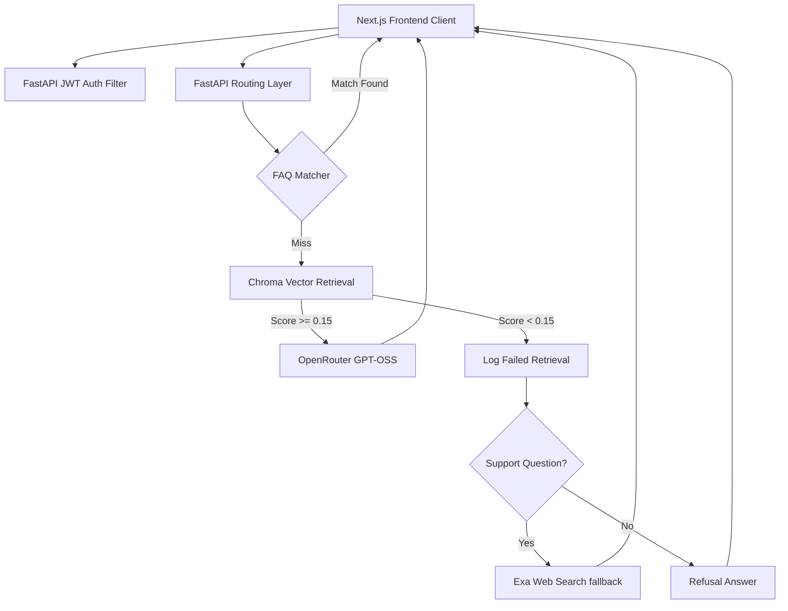

# Valar - Enterprise Customer Support Copilot

An enterprise-grade customer support AI agent platform featuring **Universal Document Ingestion**, **Expert Knowledge Copilot**, **FAQ Canned Response Router**, and **Failed Retrieval Analytics**. Built with Next.js (Frontend) and FastAPI (Backend).

## 🚀 Key Features

- **Authentication & Role-Based Access Control**: Secure JWT-based registration and login flows.
  - **Admin / Support Manager**: Can upload PDFs and text manuals, configure canned FAQ rules, and inspect search gaps.
  - **Support Agent**: Can query the Knowledge Copilot for instant customer resolution instructions.
- **Pre-Flight FAQ Router**: Bypasses vector store matching and LLM generation for pre-configured rules, enforcing case-insensitive substring matching and selecting the longest keyword match.
- **Failed Retrieval Analytics**: Logs search queries with similarity scores below the relevance limit (0.15), providing managers with metrics on knowledge gaps.
- **Persistent Hybrid RAG**: Uses ChromaDB vector stores combined with Exa Web Search fallbacks when local context fails to yield answers.

---

## 🛠️ Architecture



---

## ⚙️ Setup Guide

### 1. Backend Setup

Navigate to the `Backend` directory:
```bash
cd Backend
```

Create and activate virtual environment:
```bash
python3 -m venv venv
# Windows
.\venv\Scripts\activate
# Mac/Linux
source venv/bin/activate
```

Install dependencies:
```bash
pip install -r requirements.txt
```

Create a `.env` file in the **project root** (see `.env.example` for the full list):
```env
OPENROUTER_API_KEY=your_openrouter_api_key
EXA_API_KEY=your_exa_api_key

# Required — the app refuses to start without it.
# Generate with: python -c "import secrets; print(secrets.token_urlsafe(48))"
SECRET_KEY=your_jwt_secret_key

# Origins allowed to call the API (comma-separated)
ALLOWED_ORIGINS=http://localhost:3000

# Only needed to create the very first manager account
ADMIN_SETUP_TOKEN=some-one-time-token
```

Run the server:
```bash
uvicorn app:app --reload --port 8000
```
*Server runs at `http://localhost:8000`*

Run the API regression suite (no API credits consumed):
```bash
python test_api.py
```

#### Creating the first manager account

`/register_admin` works **only** while no manager exists, and **only** with the
`ADMIN_SETUP_TOKEN`. Visit `/manager_reg/reg` and supply that token. Once a
manager exists, further accounts are created by a signed-in manager via
`POST /admin/users`.

### 2. Frontend Setup

Navigate to the `frontend` directory:
```bash
cd ../frontend
```

Install dependencies:
```bash
npm install
```

Create a `.env.local` file (see `.env.local.example`):
```env
NEXT_PUBLIC_API_URL=http://localhost:8000
```

Run the development server:
```bash
npm run dev
```
*App runs at `http://localhost:3000`*

---

## 📌 API Endpoints

| Method | Endpoint | Description | Auth Required |
| :--- | :--- | :--- | :--- |
| `POST` | `/register` | Create a new technician account | No |
| `POST` | `/register_admin` | Bootstrap the first manager (needs `ADMIN_SETUP_TOKEN`) | No\* |
| `POST` | `/admin/users` | Create further accounts of either role | **Yes (Admin)** |
| `POST` | `/token` | Authenticate user (returns JWT) | No |
| `POST` | `/upload` | Upload a document; indexing runs in the background (202) | **Yes (Admin)** |
| `GET` | `/files` | List the corpus with per-document indexing status | **Yes (Admin)** |
| `GET` | `/files/{doc_id}/status` | Poll indexing progress for one document | **Yes (Admin)** |
| `DELETE` | `/files/{filename}` | Delete a document and purge its embeddings | **Yes (Admin)** |
| `POST` | `/reindex/{filename}` | Re-index a document in the background | **Yes (Admin)** |
| `GET` | `/faq` | Get list of all canned FAQ rules | **Yes (Admin)** |
| `POST` | `/faq` | Add a new canned FAQ rule | **Yes (Admin)** |
| `DELETE` | `/faq/{id}` | Remove a canned FAQ rule | **Yes (Admin)** |
| `GET` | `/analytics/gaps` | Failed-retrieval analytics & gap reports | **Yes (Admin)** |
| `GET` | `/analytics/feedback` | Answer-quality stats from thumbs up/down | **Yes (Admin)** |
| `GET` | `/analytics/audit` | Append-only audit trail of queries and actions | **Yes (Admin)** |
| `POST` | `/sessions` | Create a chat session | **Yes** |
| `POST` | `/sessions/{id}/ask` | Ask a question — returns answer + citations + confidence | **Yes** |
| `GET` | `/sessions/{id}/messages` | Load a conversation with its stored citations | **Yes** |
| `POST` | `/messages/{id}/feedback` | Rate an answer `helpful` / `not_helpful` | **Yes** |
| `GET` | `/users/me` | Fetch active user information | **Yes** |

\* Only succeeds while no manager account exists **and** the request carries the
correct `setup_token`.

### Answer payload

`/sessions/{id}/ask` returns grounding metadata alongside the answer:

```jsonc
{
  "answer": "Tighten the gland follower bolts to 40 Nm [1].",
  "message_id": 14,
  "confidence": 0.667,          // 0-1, blends match strength with corroboration
  "source_type": "documents",   // documents | web | faq | none
  "citations": [
    { "index": 1, "document": "SOP-PUMP-114.pdf", "page": 2,
      "snippet": "…tightened to 40 Nm in a diagonal…", "score": 0.8,
      "doc_id": 3, "url": null }
  ]
}
```

`source_type` is surfaced in the UI: `web` answers carry an explicit "not from
your document library" warning so an open-web result is never mistaken for
plant documentation.

---

## 🔒 Troubleshooting

**Error: `AttributeError: module 'bcrypt' has no attribute '__about__'`**
- **Fix**: Run `pip install "bcrypt<4.0.0"` in your virtual environment. This resolves a known compatibility conflict between `passlib` and newer `bcrypt` versions.
