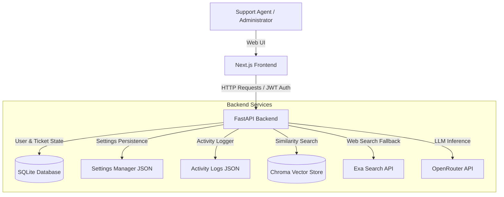

# Valar - Enterprise Support Copilot

Valar is an enterprise-grade customer support assistant and documentation retrieval platform. It integrates a deterministic FAQ matching layer, a dense passage retrieval (RAG) system, and an automated web search fallback with analytics logging. 

The architecture consists of a Next.js (TypeScript/Tailwind CSS) frontend communicating with a FastAPI backend, supported by SQLite for structural relational data and ChromaDB for vector retrieval.

---

## System Architecture



---

## Core Technical Pipelines

### 1. Canned FAQ Matching Layer
Prior to vector retrieval or LLM inference, user queries are routed through a canned FAQ matching system.
* **Deterministic Matching**: Evaluates user questions against active keyword rules stored in the SQLite database.
* **Longest-Prefix Strategy**: If multiple configured keywords match the input text, the backend selects the rule with the longest matching keyword.
* **Bypass Execution**: Returns the mapped response immediately, reducing latency to sub-millisecond ranges and avoiding LLM API token consumption.

### 2. Dense Passage Retrieval (RAG)
For query patterns not matched by the FAQ layer, the backend initiates document retrieval.
* **Vector Indexing**: Documents (PDF, TXT, DOCX) uploaded by managers are processed, chunked, and saved in a persistent ChromaDB instance.
* **Embeddings Model**: Utilizes `openai/text-embedding-ada-002` via OpenRouter to generate 1536-dimensional dense vectors.
* **Context Generation**: Performs similarity searches matching top-K chunks. Only context chunks exceeding the similarity threshold are passed to the language model.
* **LLM Orchestration**: Combines retrieved context blocks with the system prompt, sending the request to a high-capacity model (e.g., `openai/gpt-oss-120b`) via OpenRouter.

### 3. Adaptive Web Fallback & Gap Analytics
If the vector store retrieval yields no results or if similarity scores fall below the specified threshold:
* **Context Refusal Detection**: If the LLM generates a refusal message (e.g., "Sorry, I don't know based on the given context"), or if retrieval scores are low, the fallback trigger is activated.
* **Exa Web Search**: Conducts an external web search using Exa API, routing response summaries and verified citations back to the agent.
* **Knowledge Gap Logging**: Records the failed query, its highest similarity score, and the fallback status to the `failed_retrievals` table. Managers can view these gap reports to identify missing documentation areas.

---

## Dynamic Configuration Engine

Administrators can modify system settings in real time via the Advanced Settings panel. Configurations are persisted in `settings.json`:
* **Chunk Parameters**: Adjust `chunk_size` and `chunk_overlap` for document parsing.
* **Retrieval Limits**: Tune `top_k` (number of chunks retrieved) and `max_context_chunks`.
* **Similarity Threshold**: Define the minimum relevance score required to accept local document context.
* **Inference Temperature**: Tweak the creativity/determinism of the LLM responses.
* **Feature Toggles**: Enable/disable the FAQ Router, Exa Web Fallback, or Failed Retrievals Logging.
* **System Prompt Editor**: Edit instructions dynamically without restarting the FastAPI service.

---

## Database Schema & Persistence

### SQLite Tables (`users.db`)
* **`users`**: Manages credentials, password hashing (bcrypt), and roles.
* **`chat_sessions`**: Stores user chat sessions, allowing history retention.
* **`chat_messages`**: Maintains individual message logs associated with sessions.
* **`faq_rules`**: Stores keyword-to-response mappings and active flags.
* **`failed_retrievals`**: Tracks search inputs that fell below the similarity threshold.

### Audit Logging (`activity_logs.json`)
A thread-safe logger records administrative actions:
* User logins and logouts.
* Document uploads and deletions.
* Document re-indexing triggers.
* FAQ rule modifications.

---

## Development Setup

### 1. Backend Configuration
1. Navigate to the backend directory:
   ```bash
   cd Backend
   ```
2. Set up a Python virtual environment:
   ```bash
   python -m venv venv
   # Activate on Windows:
   .\venv\Scripts\activate
   # Activate on macOS/Linux:
   source venv/bin/activate
   ```
3. Install dependencies:
   ```bash
   pip install -r requirements.txt
   ```
4. Create a `.env` file in the `Backend` directory:
   ```env
   OPENROUTER_API_KEY=your_openrouter_api_key
   EXA_API_KEY=your_exa_api_key
   SECRET_KEY=your_jwt_secret_key
   ```
5. Launch the FastAPI server:
   ```bash
   uvicorn app:app --reload --port 8000
   ```

### 2. Frontend Configuration
1. Navigate to the frontend directory:
   ```bash
   cd frontend
   ```
2. Install npm packages:
   ```bash
   npm install
   ```
3. Create a `.env.local` file in the `frontend` directory:
   ```env
   NEXT_PUBLIC_BACKEND_URL=http://localhost:8000
   ```
4. Run the Next.js development server:
   ```bash
   npm run dev
   ```
5. Access the user interface at `http://localhost:3000`.

---

## System Verification

To run automated checks and verify API endpoints, execute the python testing module in the Backend directory:
```bash
python test_grounding.py
```
This module verifies vector database retrieval correctness, validation threshold boundaries, and prompt grounding integrity.
