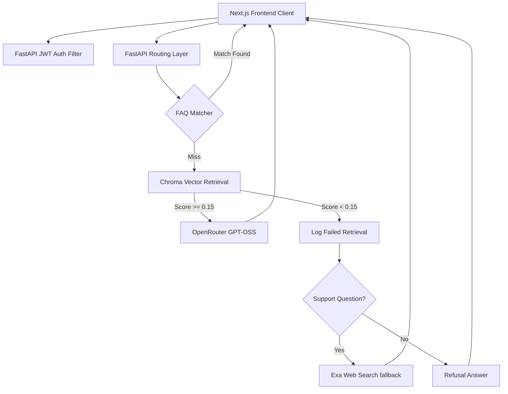

# Valar - Enterprise Customer Support Copilot

An enterprise-grade customer support AI agent platform featuring **Universal Document Ingestion**, **Expert Knowledge Copilot**, **FAQ Canned Response Router**, and **Failed Retrieval Analytics**. Built with Next.js (Frontend) and FastAPI (Backend).

## 🚀 Key Features

- **Authentication & Role-Based Access Control**: Secure JWT-based registration and login flows.
  - **Admin / Support Manager**: Can upload PDFs and text manuals, configure canned FAQ rules, and inspect search gaps.
  - **Support Agent**: Can query the Knowledge Copilot for instant customer resolution instructions.
- **Pre-Flight FAQ Router**: Bypasses vector store matching and LLM generation for pre-configured rules, enforcing case-insensitive substring matching and selecting the longest keyword match.
- **Failed Retrieval Analytics**: Logs search queries with similarity scores below the relevance limit (0.15), providing managers with metrics on knowledge gaps.
- **Persistent Hybrid RAG**: Uses ChromaDB vector stores combined with Exa Web Search fallbacks when local context fails to yield answers.

---

## 🛠️ Architecture



---

## ⚙️ Setup Guide

### 1. Backend Setup

Navigate to the `Backend` directory:
```bash
cd Backend
```

Create and activate virtual environment:
```bash
python3 -m venv venv
# Windows
.\venv\Scripts\activate
# Mac/Linux
source venv/bin/activate
```

Install dependencies:
```bash
pip install -r requirements.txt
```

Create a `.env` file in the `Backend` directory:
```env
OPENROUTER_API_KEY=your_openrouter_api_key
EXA_API_KEY=your_exa_api_key
SECRET_KEY=your_jwt_secret_key
```

Run the server:
```bash
uvicorn app:app --reload --port 8000
```
*Server runs at `http://localhost:8000`*

### 2. Frontend Setup

Navigate to the `frontend` directory:
```bash
cd ../frontend
```

Install dependencies:
```bash
npm install
```

Create a `.env.local` file:
```env
NEXT_PUBLIC_BACKEND_URL=http://localhost:8000
```

Run the development server:
```bash
npm run dev
```
*App runs at `http://localhost:3000`*

---

## 📌 API Endpoints

| Method | Endpoint | Description | Auth Required |
| :--- | :--- | :--- | :--- |
| `POST` | `/register` | Create a new user account | No |
| `POST` | `/token` | Authenticate user (returns JWT) | No |
| `POST` | `/upload` | Upload & index knowledge base documents | **Yes (Admin)** |
| `GET` | `/faq` | Get list of all canned FAQ rules | **Yes (Admin)** |
| `POST` | `/faq` | Add a new canned FAQ rule | **Yes (Admin)** |
| `DELETE` | `/faq/{id}` | Remove a canned FAQ rule | **Yes (Admin)** |
| `GET` | `/analytics/gaps` | Get failed retrieval analytics & gap reports | **Yes (Admin)** |
| `POST` | `/sessions` | Create a chat session | **Yes** |
| `POST` | `/sessions/{id}/ask` | Query the RAG/FAQ chatbot | **Yes** |
| `GET` | `/users/me` | Fetch active user information | **Yes** |

---

## 🔒 Troubleshooting

**Error: `AttributeError: module 'bcrypt' has no attribute '__about__'`**
- **Fix**: Run `pip install "bcrypt<4.0.0"` in your virtual environment. This resolves a known compatibility conflict between `passlib` and newer `bcrypt` versions.
